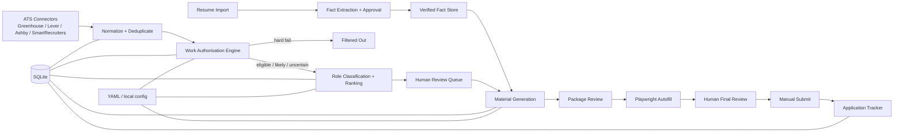

# Sponsor-Aware Job Agent

**Local-first job discovery and semi-automated application tooling for international candidates who need visa-aware filtering before they spend time tailoring applications.**

[中文说明](README_ZH.md) · [Architecture](docs/ARCHITECTURE.md) · [Design decisions](docs/DESIGN_DECISIONS.md) · [Demo](docs/DEMO.md) · [Publish to GitHub](docs/PUBLISH_TO_GITHUB.md)

> Portfolio/MVP status: the project is designed for supervised use. It can discover, rank, prepare and pre-fill applications, but it intentionally stops before final submission.

## Why this project exists

Most job-application automation starts with keyword matching and form filling. For an international candidate, that ordering is often wrong: a high-skill-match role can still be unusable because the employer, salary, contract, occupation or candidate-owned route does not support the required work authorisation.

This project makes **work-authorisation fit a first-class decision layer**. It then ranks jobs across two role tracks, tailors materials from verified resume facts, and pre-fills supported ATS forms for human review.

## What makes it different

- **Visa-aware before skill-aware** — UK, Netherlands, Germany, Ireland and Hong Kong are evaluated with separate route logic rather than a single `sponsorship=true/false` flag.
- **Candidate-owned routes are modeled explicitly** — for example, Hong Kong TTPS-style work authorisation is treated differently from employer-sponsored routes.
- **Two role tracks** — technical and technical-business roles use different ranking weights and resume tracks.
- **Evidence and provenance** — generated resume claims are constrained by approved resume facts instead of free-form rewriting.
- **Human-in-the-loop submission** — supported fields can be filled automatically, but the system never clicks the final application submit control.
- **Local-first privacy** — resumes, application artifacts, browser profiles, local configs and the SQLite database are Git-ignored by default.

## Architecture



See [docs/ARCHITECTURE.md](docs/ARCHITECTURE.md) for module boundaries and data flow.

## Supported job sources

| Source | Discovery connector | Autofill adapter |
|---|---:|---:|
| Greenhouse | Yes | Yes |
| Lever | Yes | Yes |
| Ashby | Yes | Yes |
| SmartRecruiters | Yes | Yes |

## Work-authorisation routes modeled

| Region | Route model | Ownership model |
|---|---|---|
| United Kingdom | Skilled Worker | Employer-sponsored |
| Netherlands | Highly Skilled Migrant | Employer-sponsored |
| Germany | EU Blue Card / Skilled Worker | Job-supported |
| Ireland | Critical Skills / General Employment Permit | Employer-sponsored |
| Hong Kong | TTPS-style candidate route | Candidate-owned |

The rules are configurable and require current official data. This repository is **not immigration or legal advice**.

## Role tracks

### Technical

Data engineering, analytics engineering, Python/backend, QA automation, AI application, cloud/technical support and adjacent junior engineering roles.

### Technical-business

Implementation, solutions, integration, technical project coordination, PMO/TPM, product operations and technical operations.

A mixed role can be classified against both tracks, but ranking and resume selection remain explicit.

## End-to-end workflow

```text
Discover jobs
→ normalize / deduplicate
→ evaluate work authorisation
→ classify role track
→ score and shortlist
→ review job
→ generate application package
→ validate claims against approved facts
→ approve package
→ autofill supported ATS fields
→ manually review and submit
→ track outcome
```

## Quick start

### 1. Create an environment

```bash
python -m venv .venv
```

Windows PowerShell:

```powershell
.\.venv\Scripts\Activate.ps1
python -m pip install -e ".[all,dev]"
python -m playwright install chromium
```

macOS/Linux:

```bash
source .venv/bin/activate
python -m pip install -e ".[all,dev]"
python -m playwright install chromium
```

### 2. Create local config

```bash
mkdir -p config/local
cp config/examples/*.yaml config/local/
```

On Windows, copy the files in `config/examples/` into `config/local/`.

### 3. Initialise and check the project

```bash
job-agent doctor        # creates local runtime directories
alembic upgrade head
job-agent evaluate-golden tests/golden/jobs/synthetic
```

### 4. Import a resume

```bash
job-agent resume import path/to/resume.pdf
```

Approve extracted facts in the UI before using them for generated materials:

```bash
job-agent-ui
```

### 5. Run discovery and ranking

```bash
job-agent run-daily --board-config config/local/boards.yaml
```

### 6. Generate and review an application package

```bash
job-agent generate --job-id JOB_ID --candidate default
```

Optional cover letter:

```bash
job-agent generate --job-id JOB_ID --candidate default --cover-letter
```

### 7. Pre-fill an approved application

```bash
job-agent autofill --application-id APPLICATION_ID
```

The browser session stops for human review before final submission.

## Public verification

The original Windows release was validated with a larger internal regression suite, but that suite was not bundled into the release archive. This portfolio repository therefore includes a **small public smoke suite** instead of claiming those internal tests are present here.

```bash
pytest tests/public -q
python -m compileall -q src
job-agent evaluate-golden tests/golden/jobs/synthetic
```

GitHub Actions runs the public smoke suite on Python 3.12.

## Safety boundaries

The browser workflow pauses instead of trying to bypass or infer its way through:

- CAPTCHA or anti-bot challenges;
- login or email verification;
- duplicate-application warnings;
- closed or mismatched jobs;
- unknown layouts;
- unresolved work-authorisation questions;
- legal declarations, criminal-history or sensitive self-identification fields;
- upload failures or character-limit conflicts.

See [docs/runbooks/autofill-safety.md](docs/runbooks/autofill-safety.md).

## Local data and privacy

The following paths are intentionally excluded from Git:

```text
.env
config/local/
data/
artifacts/
browser_profiles/
*.pdf
*.docx
```

Only example configuration should be committed. Do not commit real resumes, API keys, cookies or generated applications.

## Repository layout

```text
src/job_agent/
├── connectors/          # ATS discovery integrations
├── immigration/         # region-specific work-authorisation rules
├── matcher/             # role classification and ranking
├── resume_ingestion/    # parsing, extraction and fact approval
├── materials/           # resume / screening / cover-letter generation
├── autofill/            # field mapping and Playwright workflow
├── storage/             # SQLAlchemy repositories and persistence
├── ui/                  # Streamlit review workspace
└── evaluation/          # golden-dataset evaluation

config/examples/         # safe configuration templates
tests/public/            # public smoke tests
tests/golden/            # synthetic evaluation cases
docs/                    # architecture, decisions, demo and runbooks
scripts/windows/         # convenience launchers for Windows
```

## Design principles

1. Work-authorisation filtering precedes skill matching.
2. Deterministic rules own hard eligibility decisions; semantic models assist extraction and rewriting.
3. Candidate-owned and employer-sponsored routes are different state machines.
4. Generated claims must remain traceable to approved resume facts.
5. Automation can prepare and fill; a human owns the final submission.
6. The MVP stays a modular monolith so each subsystem can be tested independently without distributed-systems overhead.

More detail: [docs/DESIGN_DECISIONS.md](docs/DESIGN_DECISIONS.md).

## Limitations

- Immigration thresholds and sponsor registries change and must be refreshed from official sources.
- ATS page structures change; adapters should fail closed when field mapping is uncertain.
- The system does not guarantee sponsorship, interviews or offers.
- Ranking quality depends on the candidate profile and the quality of approved resume facts.
- The public smoke suite is intentionally smaller than the internal validation used during development.

## Roadmap

- broaden public regression fixtures for ATS and immigration edge cases;
- add configurable LLM providers and local-model fallbacks;
- improve company legal-entity resolution and registry refresh tooling;
- add exportable analytics for application funnel conversion by region and role track;
- add richer resume versioning while preserving fact-level provenance.

## Portfolio note

This repository is intended to demonstrate applied Python engineering across data ingestion, rules engines, ranking, structured generation, browser automation, persistence and human-in-the-loop product design. A concise resume-ready description is available in [docs/PORTFOLIO_RESUME_BULLETS.md](docs/PORTFOLIO_RESUME_BULLETS.md).
