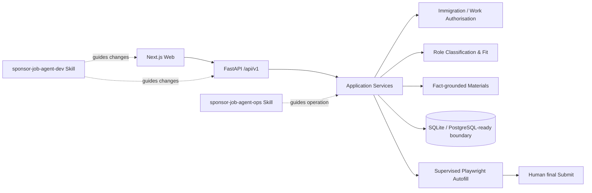

# Sponsor-Aware Job Agent

A local-first job discovery and supervised application system for candidates who need visa/work-authorisation reasoning **before** generic skill matching.

The repository now has two product surfaces:

- **Public Demo Mode** — deterministic synthetic data, safe to deploy and show to recruiters.
- **Local Mode** — real configured ATS discovery, resume facts, evidence-backed work-authorisation checks, application materials, tracking, and supervised browser autofill.

Final job submission is always manual.

## Why this exists

Most auto-apply tools optimise for application volume. For an international candidate, the first question is often more basic: **is this role legally and practically worth applying to?**

This project therefore evaluates work authorisation before match quality and preserves the evidence behind each conclusion.

## Architecture



The core invariant is:

```text
Web -> HTTP API -> Application Service -> Domain / Repository
```

The browser never independently decides immigration eligibility, fit scores, fact validity, or allowed application transitions.

## Product flow

```text
Discover jobs
  -> inspect Work Authorisation evidence
  -> inspect Candidate Fit
  -> shortlist/review
  -> generate sourced application package
  -> review screening answers / optional cover letter
  -> launch supervised autofill (Local Mode only)
  -> human reviews form
  -> human clicks final Submit
  -> track outcome
```

## Supported regions and ATS sources

Work-authorisation engine:

- United Kingdom
- Netherlands
- Germany
- Ireland
- Hong Kong

ATS connectors:

- Greenhouse
- Lever
- Ashby
- SmartRecruiters

The model deliberately does not reduce every country to `sponsor=true/false`. Employer-led routes, candidate-owned routes, salary/role constraints, unresolved checks, and registry evidence remain distinct.

## Public Demo vs Local Mode

| Capability | `APP_MODE=demo` | `APP_MODE=local` |
|---|---:|---:|
| Synthetic job discovery | Yes | No |
| Real ATS configuration | No | Yes |
| Work-authorisation evidence | Synthetic | Real configured data |
| Resume upload | No | Yes |
| Fact-grounded package workflow | Synthetic | Yes |
| Application tracker | Yes | Yes |
| Playwright launch | No | Yes |
| Final application submission | **Never** | **Manual only** |

The mode is chosen at startup; the UI cannot switch a public Demo deployment into Local Mode.

## Web application

`apps/web` contains a Next.js App Router frontend with:

- Dashboard
- Discover Jobs
- Job Detail / Review
- Application Workspace
- Applications table + Kanban
- Resume & Facts
- Immigration evidence
- secret-safe Settings summary

The application consumes the versioned FastAPI contract under `/api/v1`.

## Codex / Agent Skills

Canonical skills are checked into `skills/`:

- `sponsor-job-agent-dev` — use when modifying this repository.
- `sponsor-job-agent-ops` — use when operating a local installation.

Install them into the cross-runtime Agent Skills directory:

```bash
bash scripts/install-skills.sh --dry-run
bash scripts/install-skills.sh
```

Windows:

```powershell
./scripts/install-skills.ps1 -DryRun
./scripts/install-skills.ps1
```

See [docs/CODEX_SKILLS.md](docs/CODEX_SKILLS.md).

## Quick start — Demo API

```bash
python -m pip install -e '.[all,dev]'
APP_MODE=demo PYTHONPATH=src python -m uvicorn job_agent.api.app:app --host 127.0.0.1 --port 8000
```

Then, in another terminal:

```bash
cd apps/web
npm install
NEXT_PUBLIC_API_BASE_URL=http://127.0.0.1:8000 npm run dev -- --hostname 127.0.0.1 --port 3000
```

Open `http://127.0.0.1:3000`.

For Local Mode, see [docs/WEB_LOCAL_SETUP.md](docs/WEB_LOCAL_SETUP.md).

## Verification

Python/API/skills/public-safety checks:

```bash
PYTHONPATH=src APP_MODE=demo python -m pytest tests/api tests/public tests/skills -q
PYTHONPATH=src APP_MODE=demo python -m job_agent.api.verify_contract
python scripts/scan_public_repo.py
```

Frontend checks:

```bash
cd apps/web
npm install
npm run lint
npm run typecheck
npm test -- --run
npm run build
```

GitHub Actions is configured to run Python, Web, Skills, public-scan, and synthetic Demo E2E jobs without candidate secrets.

## Safety properties

- no automatic final Submit route or browser action;
- no CAPTCHA/login/email-verification bypass;
- no generated resume claim without approved fact provenance;
- no raw API keys, cookies, browser sessions, or secret config returned by Settings API;
- Demo Mode does not read local candidate data or browser profiles;
- public release tooling excludes real resumes, databases, local config, artifacts, `.env`, and browser profiles.

## Repository map

```text
apps/web/                       Next.js product frontend
src/job_agent/api/              FastAPI adapter
src/job_agent/application/      Workflow services
src/job_agent/immigration/      Work-authorisation rules
src/job_agent/matcher/          Role classification / scoring
src/job_agent/materials/        Fact-grounded application materials
src/job_agent/resume_ingestion/ Resume parsing and facts
src/job_agent/autofill/         Supervised autofill
src/job_agent/ui/               Legacy Streamlit admin/debug UI
skills/                         Codex/Agent Skills
scripts/                        Dev, verification, release tooling
```

## Status

The Python API, Demo service, Skills, public-safety scanner, and management API have executable repository tests. The frontend source and CI/build gates are included; run the Node verification commands after installing npm dependencies in an environment with registry access.

This is a portfolio/local productivity project, not a hosted application-submission service.
