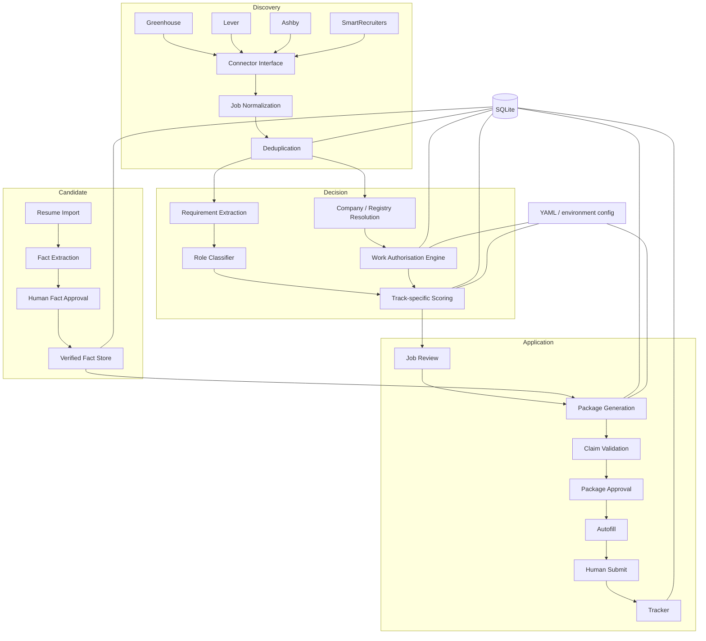

# Architecture

## System boundary

Sponsor-Aware Job Agent is a local-first modular monolith. The modules share explicit domain models and a local database, but each major responsibility is isolated behind its own package boundary.

## Module map

| Module | Responsibility | Key property |
|---|---|---|
| `connectors` | Fetch public job data from supported ATS | ATS-specific code stays behind a common connector contract |
| `jobs` | Normalize companies/jobs and detect duplicates | Stable canonical records before downstream decisions |
| `immigration` | Evaluate region-specific work-authorisation paths | Hard eligibility is deterministic and evidence-oriented |
| `matcher` | Extract requirements, classify role track and rank | Technical and technical-business weights are separate |
| `resume_ingestion` | Parse resumes and convert text into atomic facts | Imported facts require approval before downstream use |
| `materials` | Build tailored resume content, screening answers and cover letters | Generated claims are validated against approved facts |
| `autofill` | Detect, map and fill supported application fields | Fails closed and never submits the application |
| `storage` | SQLAlchemy persistence and migrations | Application state is auditable and restart-safe |
| `ui` | Streamlit review workspace | Human approval gates are visible rather than implicit |
| `evaluation` | Synthetic golden-dataset checks | Rules can be regression-tested independently of live sites |

## Primary data flow

1. **Discovery** fetches public jobs and keeps raw source context.
2. **Normalization** creates canonical titles, companies, locations and job records.
3. **Work-authorisation assessment** runs before expensive ranking/generation.
4. **Role classification** selects technical, technical-business, mixed or irrelevant.
5. **Scoring** combines work-authorisation, skills, experience, transition, language, company and recency signals.
6. **Review** keeps uncertain cases visible instead of deleting them silently.
7. **Resume facts** are imported separately, approved, and used as the evidence base for application materials.
8. **Material generation** creates a proposed package; validation checks unsupported or conflicting claims.
9. **Autofill** maps canonical fields to ATS fields and pauses for human review.
10. **Tracking** records state transitions and outcomes for later analysis.

## Work-authorisation state model

The engine deliberately separates route ownership:

- `employer_sponsored`: employer eligibility is a first-order constraint;
- `job_supported`: the job itself can support a work residence route without a classic sponsor-list model;
- `candidate_owned`: the candidate may obtain or hold independent work authorisation.

That distinction prevents incorrect logic such as filtering a Hong Kong role solely because its JD says “no sponsorship” when a candidate-owned route is active.

## Persistence

- **SQLite**: jobs, assessments, packages, applications, autofill sessions, event history and run metrics.
- **YAML**: safe configuration templates and local candidate/rule preferences.
- **Filesystem artifacts**: source resumes and generated application files, kept under Git-ignored local directories.

## Failure philosophy

The system is intentionally conservative:

- unknown immigration state → review rather than assume;
- uncertain company entity match → review rather than treat as sponsor-qualified;
- unsupported resume claim → block package approval;
- unknown form field or CAPTCHA → pause rather than guess;
- final submission → human-only.
